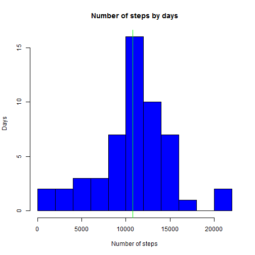
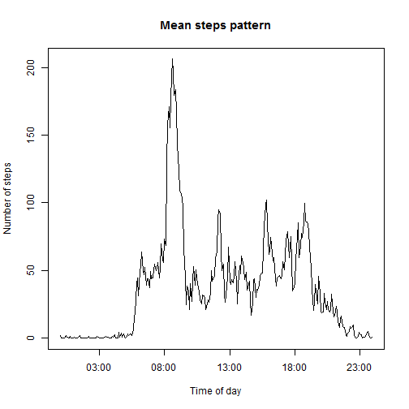
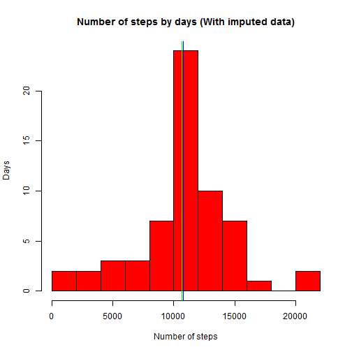
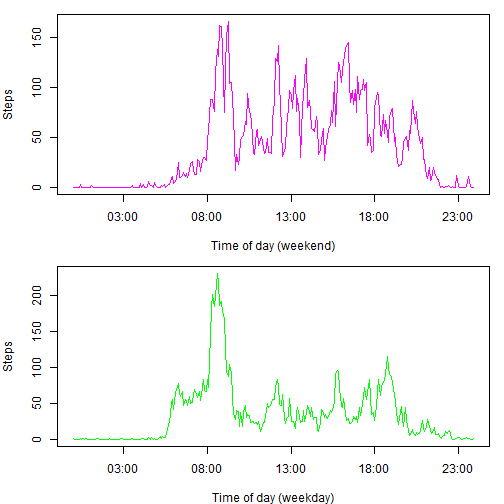

# Reproducible Research: Peer Assessment 1 
========================================================
by nsdfxela

## Loading and preprocessing the data

```r
library(data.table)
data <- read.csv("activity/activity.csv")
datadf <- data.table(data)
datadfDays <- datadf[ ,sum(steps), by=date]
datadfDays$date <- as.Date(datadfDays$date)
```

### What is mean total number of steps taken per day?

```r
##ex1
hist(datadfDays$V1, xlab="Number of steps", ylab="Days", main="Number of steps by days", col="blue", breaks=12)
mn <- mean(datadfDays$V1, na.rm=TRUE)
mdn <- median(datadfDays$V1, na.rm=TRUE)
abline(v = mn, col = "red")
abline(v = mdn, col = "green")
```

 

Mean:

```r
mn
```

```
## [1] 10766
```
Median

```r
mdn
```

```
## [1] 10765
```

### What is mean total number of steps taken per day?

```r
datadf[,"trueTime"] <- NA

times <- datadf[,"date", with=FALSE]
times <- as.POSIXlt(as.character(times$date))
numberOfDays <- length(datadfDays$date)
intervals <-rep(seq(from =0, by=5, to=(60*24)-5), times=numberOfDays)

times <- times + intervals*60
datadf[,"trueTime"] <- times
avgIntervalsByDays <- datadf[,mean(steps, na.rm=TRUE), by=interval]
avgIntervalsByDays$times <- times[1:288]
```
## What is the average daily activity pattern?

```r
plot(avgIntervalsByDays$times, avgIntervalsByDays$V1, type = "l", xlab="Time of day", ylab="Number of steps", main="Mean steps pattern")
```

 

Interval that on average across all the days in the dataset, contains the maximum number of steps

```r
avgIntervalsByDays [V1 == max(avgIntervalsByDays$V1),]$interval
```

```
## [1] 835
```

### Imputing missing values
The number of missing values is

```r
length((datadf [is.na(datadf$steps), "steps", with=FALSE])$steps)
```

```
## [1] 2304
```

We use avereges by periods to fill the missed values in dataset

```r
replace <- function (i){
  avgIntervalsByDays[interval==i]$V1
}
datadfImp <- datadf
for (i in 1:length (data$steps)){
  if(is.na(datadfImp[i]$steps))
    datadfImp[i]$steps <- replace(datadfImp[i]$interval)
}
datadfDaysImp <- datadfImp[ ,sum(steps), by=date]
datadfDaysImp$date <- as.Date(datadfDaysImp$date)
hist(datadfDaysImp$V1, xlab="Number of steps", ylab="Days", main="Number of steps by days (With imputed data)", col="red", breaks=12)
mnImp <- mean(datadfDaysImp$V1, na.rm=TRUE)
mdnImp <- median(datadfDaysImp$V1, na.rm=TRUE)

abline(v = mnImp, col = "blue")
abline(v = mdnImp, col = "green")
```

 

Mean:

```r
mnImp
```

```
## [1] 10750
```
Median:

```r
mdnImp
```

```
## [1] 10641
```
These values differ from the ones from 1st part of assignment because there was a bias in calculations of mean and median related to missing values. 

### Are there differences in activity patterns between weekdays and weekends?

```r
Sys.setlocale("LC_ALL","English")
```

```
## [1] "LC_COLLATE=English_United States.1252;LC_CTYPE=English_United States.1252;LC_MONETARY=English_United States.1252;LC_NUMERIC=C;LC_TIME=English_United States.1252"
```

```r
isWeekend <- function(day){
  if(day=="Saturday"||day=="Sunday")
    TRUE
  else FALSE
}
dayType <- sapply(weekdays(datadfImp$trueTime), isWeekend)
datadfImp <- cbind(datadfImp, dayType)
```

Separating data tables by dayType:

```r
dataWEImp <- datadfImp[dayType==TRUE,]
dataNWEImp <- datadfImp[dayType==FALSE,]

getAvgs <- function (df){
  avgs <- df[,mean(steps, na.rm=TRUE), by=interval]
  avgs$times <- times[1:288]  
  avgs
}
WEIavg <- getAvgs(dataWEImp)
NWEIavg <- getAvgs(dataNWEImp)


par(mfrow=c(2,1), mar=c(4,4,1,1))
plot(WEIavg$times, WEIavg$V1, type = "l", xlab="Time of day (weekend)", col="magenta", ylab="Steps")
plot(NWEIavg$times, NWEIavg$V1, type = "l", xlab="Time of day (weekday)", col="green",ylab="Steps")
```

 

Answer is: yes, patterns are different (see plots)


